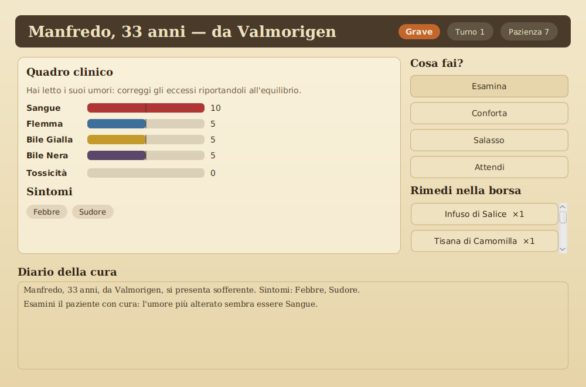
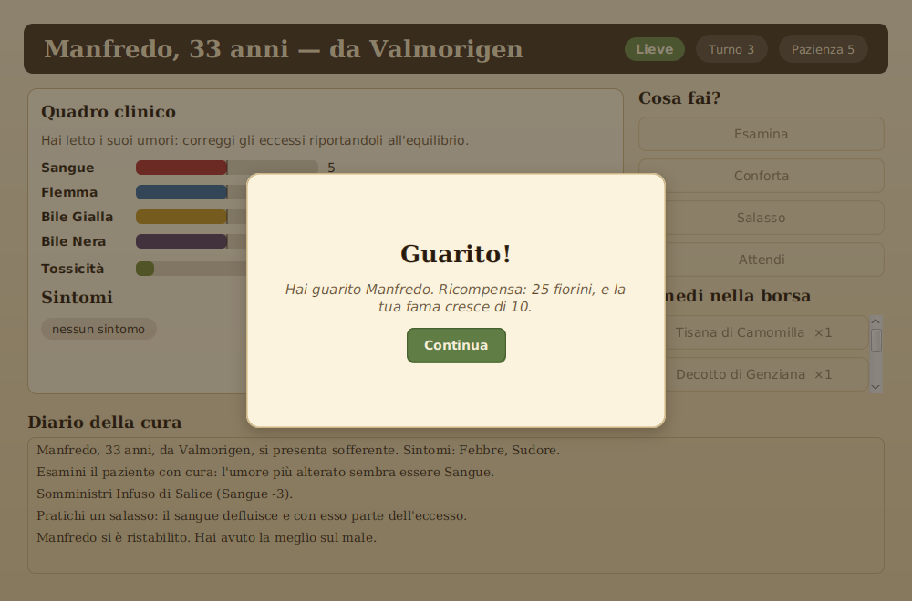
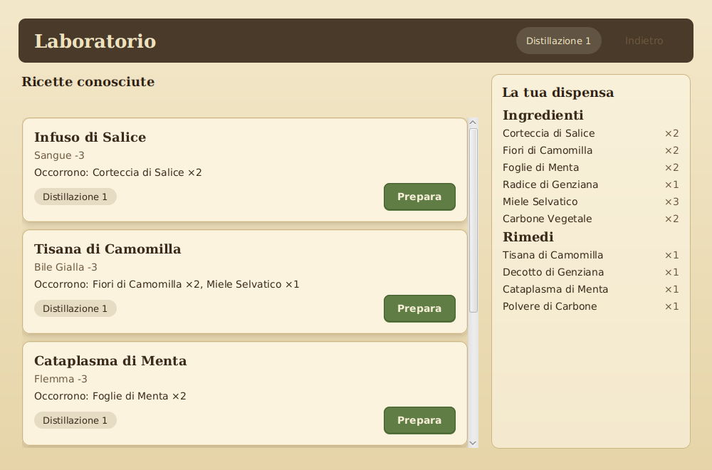
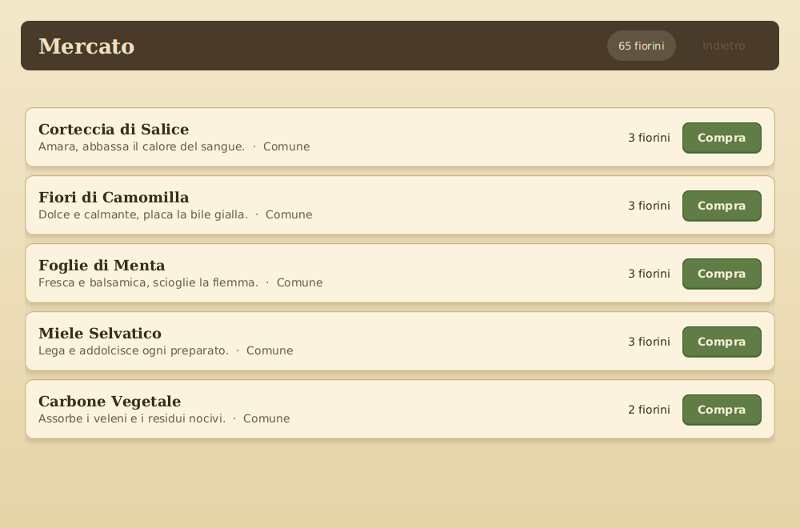
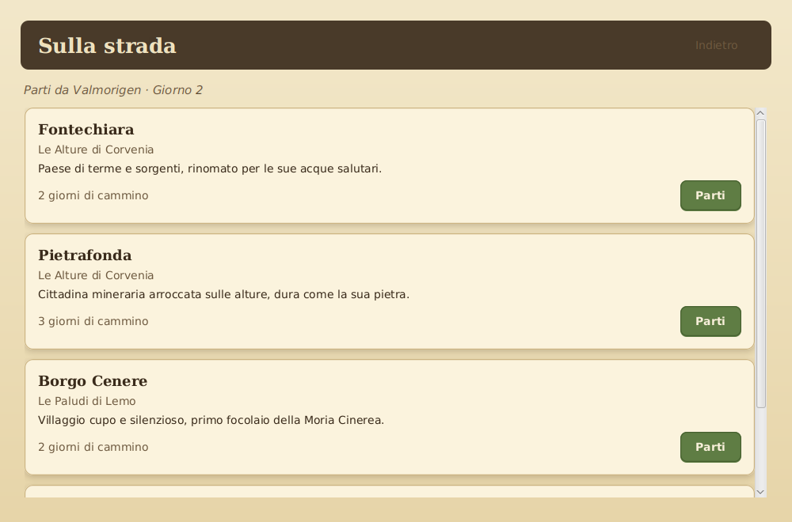

# Funzionalità

## Creazione e progressione dello speziale

All'avvio di una nuova partita si sceglie il nome dello speziale. Il personaggio
possiede tre **abilità** che crescono con l'uso:

- **Diagnosi** — migliora esaminando e curando i pazienti;
- **Erboristeria** — migliora acquistando ingredienti;
- **Distillazione** — migliora preparando rimedi e regola quali ricette si
  possono tentare.

A queste si affiancano la **fama** (con i ranghi _Sconosciuto → Praticante →
Guaritore → Luminare_) e una borsa di **fiorini**.

## Diagnosi e cura a turni

È il cuore del gioco. Ogni paziente soffre di un **malanno**, descritto da uno
squilibrio dei quattro umori (sangue, flemma, bile gialla, bile nera) e dai
sintomi che ne derivano.

Gli umori del paziente restano **nascosti** finché non lo si **esamina**: la cura
è quindi un piccolo enigma diagnostico. Ad ogni turno si può:

- **Esaminare** — rivela gli umori e indica quello più alterato;
- **Somministrare un rimedio** — ne applica gli effetti (sposta gli umori, aggiunge
  o rimuove tossicità);
- **Confortare** — restituisce un po' di pazienza al malato e ne allevia la
  tossicità;
- **Praticare un salasso** — riduce il sangue, ma è rischioso e lascia tossicità;
- **Attendere** — lascia trascorrere il turno.

Finché gli umori non sono in equilibrio il male **peggiora**; quando lo sono, il
corpo **recupera**. La visita termina con la **guarigione**, con la **morte** del
paziente se resta troppo a lungo in stato critico, o con l'**abbandono** se il
malato perde la pazienza.

## Preparazione dei rimedi

Nel **laboratorio** lo speziale prepara i rimedi che conosce, consumando gli
ingredienti richiesti dalla ricetta. La preparazione richiede un livello minimo
di Distillazione e dà esperienza.

## Mercato e viaggio

Ogni villaggio ha un **mercato** che vende un proprio assortimento di ingredienti,
a un prezzo che cresce con la rarità.

Si **viaggia** tra i villaggi pagando in giorni di cammino; ogni villaggio ha mali
e ingredienti caratteristici.

## Salvataggio e ripresa

La partita può essere **salvata** in qualsiasi villaggio e **ripresa** dal menù
principale. Il salvataggio è un file JSON nella cartella personale dell'utente.

## Obiettivo

Curando e accrescendo la propria fama fino al rango di **Luminare**, lo speziale
porta la salute nelle terre flagellate dalla Moria e conclude la partita.
