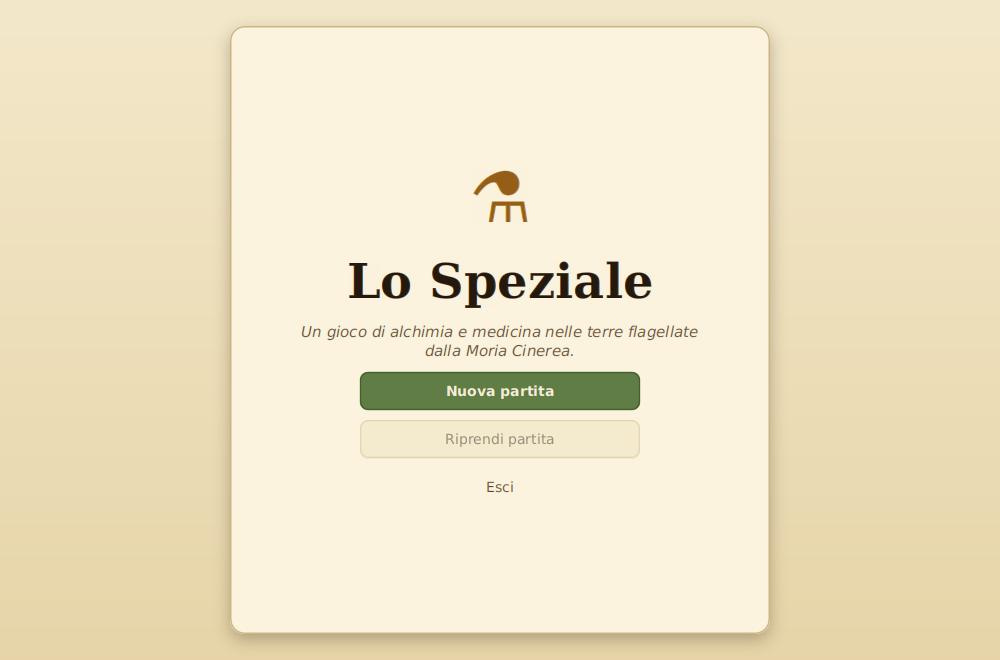

# Lo Speziale

**Lo Speziale** è un gioco di ruolo di alchimia e medicina ambientato in un regno
flagellato da una pestilenza, la _Moria Cinerea_. Il giocatore veste i panni di
uno speziale errante che viaggia di villaggio in villaggio, diagnostica i mali
secondo la teoria dei **quattro umori**, prepara rimedi dagli ingredienti e cura
i pazienti in incontri a turni, accrescendo via via le proprie abilità e la
propria fama.



## Il gioco è il contesto

L'obiettivo del progetto **non** è realizzare un videogioco completo, ma mostrare
un **sistema software ben progettato** — responsabilità chiare, principi SOLID,
Clean Code, estendibilità — usando un gioco di ruolo come scenario applicativo,
con gli strumenti e le metodologie viste nel corso di _Metodologie di
Programmazione_ (UNICAM, A.A. 2025/2026).

La scelta del tema nasce da un'idea precisa: invece del solito _dungeon crawler_
a combattimento, lo scenario è quello della **medicina umorale medievale**. Ne
deriva un dominio ricco ma ordinato — umori, sintomi, malanni, ingredienti,
rimedi, ricette — che si presta bene a essere modellato con classi dalle
responsabilità nette e a essere esteso con nuovi contenuti senza toccare il
codice.

## Indice della documentazione

- **[Funzionalità](Funzionalità)** — cosa si può fare nel gioco
- **[Architettura](Architettura)** — i livelli del sistema e come dialogano
- **[Responsabilità delle classi e delle interfacce](Responsabilità-delle-classi)**
- **[Organizzazione dei dati e persistenza](Organizzazione-dei-dati-e-persistenza)**
- **[Estendibilità](Estendibilità)** — come aggiungere contenuti e funzionalità
- **[Principi SOLID e Clean Code](Principi-SOLID-e-Clean-Code)**
- **[Dichiarazione sull'uso di strumenti di AI](Dichiarazione-uso-AI)**

## Il ciclo di gioco in breve

1. In un **villaggio** attendono dei malati; ognuno porta un _malanno_ con i suoi
   sintomi e una gravità.
2. Si avvia la **visita**: si **esamina** il paziente per leggerne gli umori, poi
   si **somministrano rimedi**, si **conforta** o si pratica un **salasso** per
   riportare gli umori all'equilibrio prima che la gravità diventi fatale.
3. Curare dà **fama**, **fiorini** ed **esperienza**; fallire intacca la fama.
4. Al **laboratorio** si preparano nuovi rimedi, al **mercato** si comprano
   ingredienti, e si **viaggia** verso altri villaggi mentre scorrono i giorni.
5. La partita si può **salvare** e riprendere. Raggiunto il rango di **Luminare**
   la si conclude vittoriosamente.


## Come compilare ed eseguire

```bash
./gradlew build   # compila ed esegue i test
./gradlew run     # avvia l'applicazione
```

Tutte le classi appartengono al package `it.unicam.cs.mpgc.rpg126114`.
